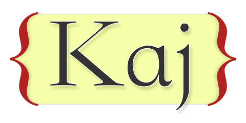

Kaj Markup Language
===================

Kaj is a simple and extensible markup language for writing HTML5 documents.

Kaj is similar to reStructuredText (reST).

Powerful features
=================

* Basic markups (inline/block level)
* Customizable "role"s
* Customizable "directive"s
* Customizable renderers
* Aliases for "role"s and "directive"s are possible. (for internationalization)

Demo: http://jakwings.github.io/Kaj-Markup-Language/

Implementations
===============

* **Official** [kaj.js](https://github.com/jakwings/kaj.js) (JavaScript, Node.js)

License Information
===================

  
   
  To the extent possible under law,
  <a rel="dct:publisher"
     href="https://github.com/jakwings/Kaj-Markup-Language">
    Jak Wings</a>
  has waived all copyright and related or neighboring rights to
  Kaj Markup Language.

